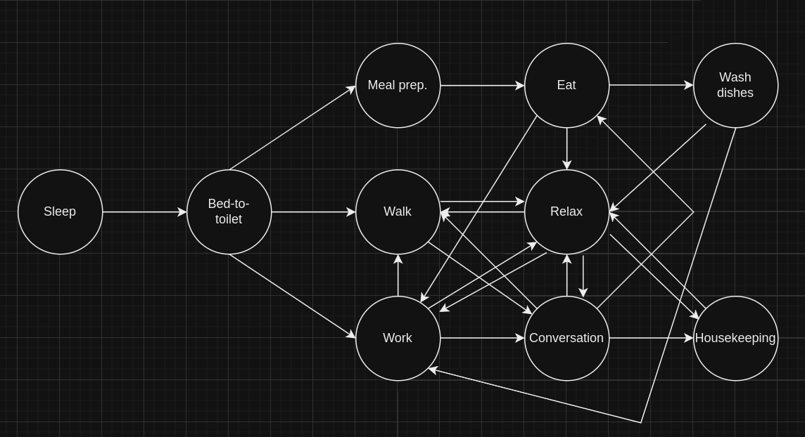

# Automaton
Automaton, discrete math project
The state diagram:

Typical day looks like this:
-----------------
Transitioning from Sleeping to Sleeping
Energy 0
Mood 0
Food 80
Sleep_deposit: 0
Current time: 00:00
Random event: Headache
-----------------
Transitioning from Sleeping to Sleeping
Energy 0
Mood 10
Food 70
Sleep_deposit: 10
Current time: 01:00
-----------------
Transitioning from Sleeping to Sleeping
Energy 0
Mood 20
Food 60
Sleep_deposit: 20
Current time: 02:00
Random event: Bad news
-----------------
Transitioning from Sleeping to Sleeping
Energy 0
Mood 30
Food 50
Sleep_deposit: 30
Current time: 03:00
Random event: Bad news
-----------------
Transitioning from Sleeping to Sleeping
Energy 0
Mood 40
Food 40
Sleep_deposit: 40
Current time: 04:00
Random event: Bad news
-----------------
Transitioning from Sleeping to Sleeping
Energy 0
Mood 50
Food 30
Sleep_deposit: 50
Current time: 05:00
Random event: Headache
-----------------
Transitioning from Sleeping to Sleeping
Energy 0
Mood 60
Food 20
Sleep_deposit: 60
Current time: 06:00
Random event: Call
-----------------
Transitioning from Sleeping to Sleeping
Energy 0
Mood 70
Food 10
Sleep_deposit: 70
Current time: 07:00
Random event: Call
-----------------
Transitioning from Sleeping to Meal Preparation
Energy 0
Mood 80
Food 0
Sleep_deposit: 80
Current time: 08:00
Random event: Headache
-----------------
Transitioning from Meal Preparation to Relaxing
Energy -5
Mood 80
Food 20
Sleep_deposit: 75
Current time: 08:30
-----------------
Transitioning from Relaxing to Conversation
Energy 45
Mood 95
Food 15
Sleep_deposit: 70
Current time: 09:00
Random event: Headache
-----------------
Transitioning from Conversation to Meal Preparation
Energy 40
Mood 100
Food 10
Sleep_deposit: 70
Current time: 09:30
Random event: Bad news
-----------------
Transitioning from Meal Preparation to Eating
Energy 35
Mood 100
Food 30
Sleep_deposit: 65
Current time: 10:00
Random event: Call
-----------------
Transitioning from Eating to Work
Energy 40
Mood 110
Food 60
Sleep_deposit: 60
Current time: 10:30
Random event: Bad news
-----------------
Transitioning from Work to Walk
Energy 25
Mood 105
Food 50
Sleep_deposit: 60
Current time: 11:30
-----------------
Transitioning from Walk to Relaxing
Energy 15
Mood 115
Food 40
Sleep_deposit: 55
Current time: 12:00
Random event: Headache
-----------------
Transitioning from Relaxing to Walk
Energy 65
Mood 130
Food 35
Sleep_deposit: 50
Current time: 12:30
Random event: Call
-----------------
Transitioning from Walk to Conversation
Energy 55
Mood 140
Food 25
Sleep_deposit: 45
Current time: 13:00
-----------------
Transitioning from Conversation to Housekeeping
Energy 50
Mood 145
Food 20
Sleep_deposit: 45
Current time: 13:30
Random event: Headache
-----------------
Transitioning from Housekeeping to Meal Preparation
Energy 40
Mood 140
Food 10
Sleep_deposit: 40
Current time: 14:00
Random event: Bad news
-----------------
Transitioning from Meal Preparation to Eating
Energy 35
Mood 140
Food 30
Sleep_deposit: 35
Current time: 14:30
Random event: Call
-----------------
Transitioning from Eating to Relaxing
Energy 40
Mood 150
Food 60
Sleep_deposit: 30
Current time: 15:00
Random event: Headache
-----------------
Transitioning from Relaxing to Housekeeping
Energy 90
Mood 165
Food 55
Sleep_deposit: 25
Current time: 15:30
Random event: Bad news
-----------------
Transitioning from Housekeeping to Relaxing
Energy 80
Mood 160
Food 45
Sleep_deposit: 20
Current time: 16:00
Random event: Bad news
-----------------
Transitioning from Relaxing to Walk
Energy 130
Mood 175
Food 40
Sleep_deposit: 15
Current time: 16:30
-----------------
Transitioning from Walk to Conversation
Energy 120
Mood 185
Food 30
Sleep_deposit: 10
Current time: 17:00
Random event: Headache
-----------------
Transitioning from Conversation to Relaxing
Energy 115
Mood 190
Food 25
Sleep_deposit: 10
Current time: 17:30
-----------------
Transitioning from Relaxing to Housekeeping
Energy 165
Mood 205
Food 20
Sleep_deposit: 5
Current time: 18:00
Random event: Bad news
-----------------
Transitioning from Housekeeping to Sleeping
Energy 155
Mood 200
Food 10
Sleep_deposit: 0
Current time: 18:30
Random event: Call
-----------------
Transitioning from Sleeping to Sleeping
Energy 155
Mood 210
Food 0
Sleep_deposit: 10
Current time: 19:30
Random event: Headache
-----------------
Transitioning from Sleeping to Sleeping
Energy 155
Mood 220
Food -10
Sleep_deposit: 20
Current time: 20:30
Random event: Bad news
-----------------
Transitioning from Sleeping to Sleeping
Energy 155
Mood 230
Food -20
Sleep_deposit: 30
Current time: 21:30
Random event: Headache
-----------------
Transitioning from Sleeping to Sleeping
Energy 155
Mood 240
Food -30
Sleep_deposit: 40
Current time: 22:30
Random event: Headache
-----------------
Transitioning from Sleeping to Sleeping
Energy 155
Mood 250
Food -40
Sleep_deposit: 50
Current time: 23:30

This is a full day. As may be seen, due to big amount of events day looks very realistic and almost none activities repeat.
Also a bunch of characteristics were added, such as Energy, Mood, etc. that also impact the next state.
Usualy days aren't very similiar to each other thanks to random chars generation.